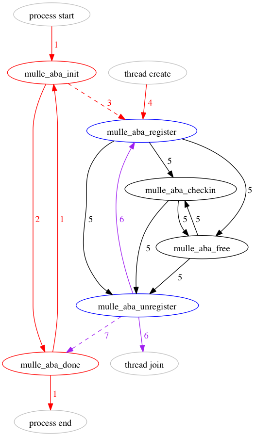

# mulle-aba

## Intro

**mulle_aba** is a (pretty much) lock-free solution to the [ABA problem](https://en.wikipedia.org/wiki/ABA_problem) 
based on C11. As a fallback [pthreads](https://en.wikipedia.org/wiki/POSIX_Threads)
and [mintomic](https://mintomic.github.io/) can be used. It is written in C.

Threads have to cooperate for this scheme to work. If a non-registered thread is 
accessing memory referenced by a **mulle-aba** pointer, your program is likely 
to crash. If a registered thread is not checking in regularly, your program 
will bloat. Such is the rule of **mulle-aba**.

This page gives you the necessary information to use **mulle-aba** in your own 
programs. The [blog entries](//www.mulle-kybernetik.com/weblog/2015/mulle_aba_release.html) 
should give you an overview of its operation. [BUILD.md](BUILD.md) gives you
the know how, how to build it.




Node Colors

* Red   : single threaded
* Blue  : soft locking, multi threaded
* Black : lock free, multi threaded
* Gray  : context

Edge style

* Dashed : main thread (the one who called mulle_aba_init)
* Solid  : any thread

# API

### `void mulle_aba_init( struct mulle_allocator *allocator)`

*Available in state 1 (red)*

Call this function to initialize **mulle-aba**. Don't call any other 
**mulle-aba** function before calling this. In terms of the diagram you are in 
State 1 (red). The allocator will be used to allocate memory for the 
**mulle-aba** system. It is a struct defined like this:

```c
struct mulle_allocator
{
   void   *(*calloc)( size_t, size_t);
   void   *(*realloc)( void *, size_t);
   void   (*free)( void *);
};
```

If you pass in NULL, standard `calloc`, `realloc`, `free` will be used.

This function is not thread safe (red).

Ex.

```c
mulle_aba_init( NULL);
```


## `void mulle_aba_done( void)`

*Available in state 2 (red) an 6 (purple)*

Call this function to finish **mulle-aba**. Your process needs to call 
`mulle_aba_init` again before doing anything with **mulle-aba**. Be very sure 
that all participating threads have unregistered **and** joined before calling 
**mulle_aba_done**.

This function is not thread safe (red).


## `void   mulle_aba_register( void)`

*Available in states 3 (red) and 5 (purple)*

Your thread must call this function before accessing any shared resources that 
should be protected by **mulle_aba**. The main thread should also call  
**mulle_aba_register**.

Only one thread can be registering (or unregistering) at once, and other threads 
will be looping. The registration does not block or lock **mulle_aba_free** 
or **mulle_aba_checkin**!

This is a soft-blocking (blue) operation.

Ex.

```c
static void  run_thread( void *info)
{
    mulle_aba_register();
    ...
}

...
mulle_thread_create( &threads, NULL, (void *) run_thread, "VfL Bochum 1848");
...
```


### `int   mulle_aba_is_registered( void)`

*Always available*

You can check if the current thread is registered with this function.
Returns 0, if not registerd.


### `void   mulle_aba_unregister( void)`

*Available in state 4 (black)*

You usually don't need to call this function, since it will be called by the 
thread destructor. You do need to call this if you are the main thread.

Only one thread can be unregistering (or registering) at once, and other threads 
will be looping. You don't have to call checkin before calling 
**mulle_aba_unregister**.

This is a soft-blocking (blue) operation. 


### `int   mulle_aba_free( void *pointer, void (*free)( void *))`

*Available in state 4 (black)*

Use this function to free a shared pointer in a delayed way. In a cooperative 
setting, this guarantees that the freed pointer does not run afoul of the ABA 
problem. The actual freeing of the pointer is delayed until all threads have 
checked in.

This operation is lock-free (black). Note that if your **free** operation is 
locking or blocking, then **mulle-aba**'s main operation is not lock-free.

Ex.

```c
    s = some_unused_shared_malloced_resource();
    mulle_aba_free( s, free);
```


### `void   mulle_aba_checkin( void)`

*Available in state 4 (black)*

This function must be periodically called by all cooperating threads. It acts 
like a memory barrier and frees delayed pointers, that have been relinquished 
by all other threads.

This operation is lock-free (black). If any `free` routine of the pointers 
blocks or locks, this operation also blocks.
