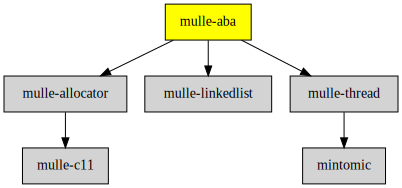

# mulle-aba

#### 🚮 A lock-free, cross-platform solution to the ABA problem

**mulle_aba** is a (pretty much) lock-free, cross-platform solution to the
[ABA problem](//en.wikipedia.org/wiki/ABA_problem) written in C.

The ABA problem appears, when you are freeing memory, that is shared by
multiple threads and is not protected by a lock. As the subject matter is
fairly complicated, please read the [Wikipedia article](//en.wikipedia.org/wiki/ABA_problem) and maybe [Preshing: An Introduction to Lock-Free Programming](http://preshing.com/20120612/an-introduction-to-lock-free-programming/) first and then checkout the following items:

* [mulle-aba: How it works 1](//www.mulle-kybernetik.com/weblog/2015/mulle_aba_how_it_works_1.html)
* [mulle-aba: How it works 2](//www.mulle-kybernetik.com/weblog/2015/mulle_aba_how_it_works_2.html)
* [mulle-aba: How it works 3](//www.mulle-kybernetik.com/weblog/2015/mulle_aba_how_it_works_3.html)
* [Example](example/main.m)


| Release Version                                       | Release Notes  | AI Documentation
|-------------------------------------------------------|----------------|---------------
|  [](//github.com/mulle-concurrent/mulle-aba/actions) | [RELEASENOTES](RELEASENOTES.md) | [DeepWiki for mulle-aba](https://deepwiki.com/mulle-concurrent/mulle-aba)


## API

* [Aba](dox/API_ABA.md)


### You are here




## Add

**This project is a component of the [mulle-core](//github.com/mulle-core/mulle-core) library. As such you usually will *not* add or install it
individually, unless you specifically do not want to link against
`mulle-core`.**


### Add as an individual component

Use [mulle-sde](//github.com/mulle-sde) to add mulle-aba to your project:

``` sh
mulle-sde add github:mulle-concurrent/mulle-aba
```

To only add the sources of mulle-aba with dependency
sources use [clib](https://github.com/clibs/clib):


``` sh
clib install --out src/mulle-concurrent mulle-concurrent/mulle-aba
```

Add `-isystem src/mulle-concurrent` to your `CFLAGS` and compile all the sources that were downloaded with your project.


## Install

Use [mulle-sde](//github.com/mulle-sde) to build and install mulle-aba and all dependencies:

``` sh
mulle-sde install --prefix /usr/local \
   https://github.com/mulle-concurrent/mulle-aba/archive/latest.tar.gz
```

### Legacy Installation

Install the requirements:

| Requirements                                 | Description
|----------------------------------------------|-----------------------
| [mulle-allocator](https://github.com/mulle-c/mulle-allocator)             | 🔄 Flexible C memory allocation scheme
| [mulle-thread](https://github.com/mulle-concurrent/mulle-thread)             | 🔠 Cross-platform thread/mutex/tss/atomic operations in C
| [mulle-linkedlist](https://github.com/mulle-concurrent/mulle-linkedlist)             | 🔂 mulle-linkedlist a wait and lock-free linked list

Download the latest [tar](https://github.com/mulle-concurrent/mulle-aba/archive/refs/tags/latest.tar.gz) or [zip](https://github.com/mulle-concurrent/mulle-aba/archive/refs/tags/latest.zip) archive and unpack it.

Install **mulle-aba** into `/usr/local` with [cmake](https://cmake.org):

``` sh
PREFIX_DIR="/usr/local"
cmake -B build                               \
      -DMULLE_SDK_PATH="${PREFIX_DIR}"       \
      -DCMAKE_INSTALL_PREFIX="${PREFIX_DIR}" \
      -DCMAKE_PREFIX_PATH="${PREFIX_DIR}"    \
      -DCMAKE_BUILD_TYPE=Release &&
cmake --build build --config Release &&
cmake --install build --config Release
```


## Author

[Nat!](https://mulle-kybernetik.com/weblog) for Mulle kybernetiK  


